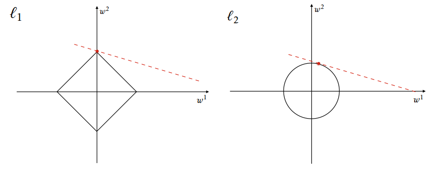

# Regularización con L1 y L2

La regularización, en matemáticas y estadística y particularmente en los campos de *Machine Learning* y problemas inversos, se refiere a un proceso de introducir información adicional para solucionar un problema mal definido o para impedir el *sobreajuste*.

||
|:--:|
| **l1&l2** from: [The Mystery of Early Stopping](http://fouryears.eu/2017/12/06/the-mystery-of-early-stopping/)|

What is Regularization?
Regularization is a technique to discourage the complexity of the model. It does this by penalizing the loss function. This helps to solve the overfitting problem.

## Regularización L1

En la norma L1 reducimos los parámetros a cero. Cuando las características de entrada tienen pesos más cercanos a cero, esto conduce a una norma L1 dispersa. En la solución Sparse, la mayoría de las características de entrada tienen pesos cero y muy pocas características tienen pesos distintos de cero.
Para predecir el puntaje ACT no todas las características de entrada tienen la misma influencia en la predicción. El puntaje de GPA tiene una mayor influencia en el puntaje de ACT que el IMC del estudiante. La norma L1 asignará un peso cero al IMC del estudiante, ya que no tiene un impacto significativo en la predicción. El puntaje de GPA tendrá un peso distinto de cero, ya que es muy útil para predecir el puntaje de ACT.
La regularización de L1 presenta selección de características. Para ello, asigna características de entrada insignificantes con peso cero y características útiles con un peso distinto de cero.

## Regularización L2

En la regularización L2, el término de regularización es la suma del cuadrado de todos los pesos de entidades como se muestra arriba en la ecuación.

La regularización de L2 obliga a los pesos a ser pequeños, pero no los hace cero y no es una solución dispersa.
L2 no es robusto para los valores atípicos, ya que los términos cuadrados explotan las diferencias de error de los valores atípicos y el término de regularización intenta solucionarlo penalizando los pesos
La regresión de cresta funciona mejor cuando todas las características de entrada influyen en la salida y todas las pesas tienen un tamaño aproximadamente igual.
