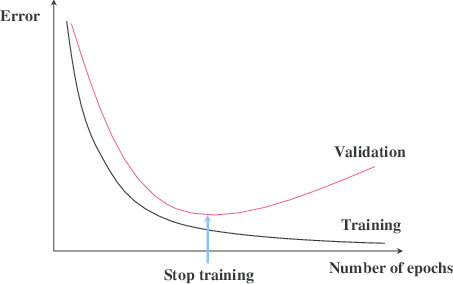

## Early stopping

||
|:--:|
| **early stopping** from: [The Mystery of Early Stopping](http://fouryears.eu/2017/12/06/the-mystery-of-early-stopping/)|

De acuerdo a [wikipedia](https://en.wikipedia.org/wiki/Early_stopping): En *machine learning*, la detención temprana(**early stopping**) es una forma de *regularización* que se usa para evitar el sobreajuste(*overfitting*) al entrenar un modelo con un método iterativo, como el *descenso por gradiente*. Dichos métodos actualizan al modelo para que se ajuste mejor a los datos de entrenamiento con cada iteración. Hasta cierto punto, esto mejora el rendimiento del modelo en los datos fuera del conjunto de capacitación. Pasado ese punto, sin embargo, mejorar el ajuste del modelo a los datos de capacitación se produce a expensas de un mayor error de generalización. Las reglas de detención temprana brindan orientación sobre cuántas iteraciones se pueden ejecutar antes de que el modelo comience a ajustarse demasiado. Se han empleado reglas de detención temprana en muchos métodos diferentes de aprendizaje automático, con cantidades variables de fundamentos teóricos.

