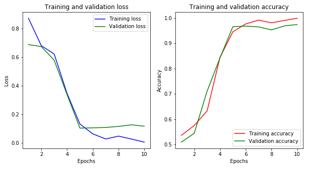

# Descripción:

En este modelo utilizamos transfer learning a partir del modelo VGG16 + Fully connected Layers.

# Resultados:

{'val_loss': [0.6878404116630554, 0.6741729998588561, 0.5788121223449707, 0.33859180331230165, 0.1043682113289833, 0.10622499532997608, 0.10901278607547284, 0.11625871732831002, 0.1276897132769227, 0.11777968019247055], 'val_acc': [0.509375, 0.544375, 0.710625, 0.841875, 0.965, 0.9675, 0.964375, 0.9525, 0.968125, 0.97375], 'loss': [0.8721252195040385, 0.6801971244812012, 0.6222298725446065, 0.34687129000822703, 0.13285350129008294, 0.06433093090852102, 0.0285504380458345, 0.04858985907242944, 0.028012306322925725, 0.006452959198601699], 'acc': [0.53625, 0.575, 0.6325, 0.8439583333333334, 0.9452083333333333, 0.9760416666666667, 0.9910416666666667, 0.9804166666666667, 0.9897916666666666, 0.9985416666666667]}

# Práctica:

Se recomienda realizar el ejercicio y modificar los valores de hiperparámetros. 

# Referencias: 

[1] Simonyan, K., & Zisserman, A. (2014). Very deep convolutional networks for large-scale image recognition. arXiv preprint arXiv:1409.1556.
[2] Base de datos descargada desde: https://www.kaggle.com/chetankv/dogs-cats-images [10 de feb de 2020].
