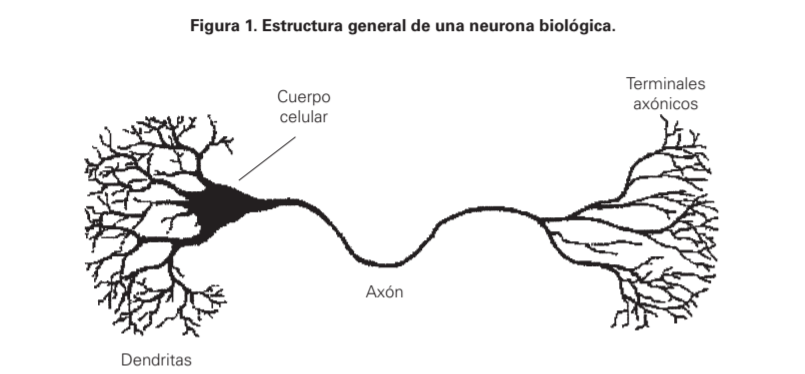
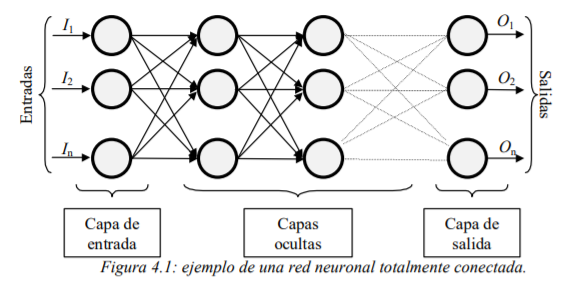
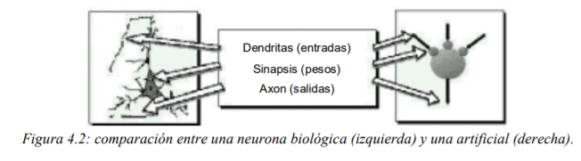

# ¿Qué es una red neuronal?

*Las RNA son sistemas de procesamiento de la información cuya estructura y funcionamiento están inspirados en las redes neuronales biológicas.* (Hilera y Martínez, 1995).

## Caracteristicas generales

- Consisten en un gran número de elementos simples de procesamiento llamados nodos o neuronas que están organizados en capas.
- Cada neurona está conectada con otras neuronas mediante enlaces de comunicación, cada uno de los cuales tiene asociado un peso.
- Los pesos representan la información que será usada por la red neuronal para resolver un problema determinado.

Así, las RNA son sistemas adaptativos que aprenden de la experiencia, esto es, aprenden a llevar a cabo ciertas tareas mediante un entrenamiento con ejemplos ilustrativos.
Mediante este entrenamiento o aprendizaje, las RNA crean su propia representación interna del problema, por tal motivo se dice que son autoorganizadas.

- Las RNA son capaces de generalizar de casos anteriores a casos nuevos.
- Esta característica es fundamental ya que permite responder correctamente a informaciones:
  - novedosas
  - distorcionadas o incompletas
- Funcionan en paralelo
  - Muchas neuronas pueden estar trabajando al mismo tiempo

# Elementos básicos

A continuación se muestra la estructura básica de una red neuronal.

La misma está constituida por neuronas interconectadas y arregladas en tres capas (esto último puede variar). Los datos ingresan por medio de la “capa de entrada”, pasan a través de la “capa oculta” y salen por la “capa de salida”. Cabe mencionar que la capa oculta puede estar constituida por varias capas.

Ahora que ya se explico un poco la estructura básica de una red neuronal y su parentezco con una red biologica vamos a hacer una comparacion un poco más grafica.

*Biológicamente, se suele aceptar que el conocimiento está más relacionado con las conexiones entre neuronas que con las propias neuronas* (Alkon, 1989;Shepherd, 1990);
es decir, el conocimiento se encuentra distribuido por las sinapsis de la red. De forma análoga, en el caso de las RNA se puede considerar que el conocimiento se encuentra representado en los pesos de las conexiones entre neuronas.

## Función de entrada (input function)

La neurona trata a muchos valores de entrada como si fueran uno solo; esto recibe el nombre de entrada global.
Los valores de entrada se multiplican por los pesos anteriormente ingresados a la neurona. Por consiguiente, los pesos que generalmente no están restringidos cambian la medida de influencia que tienen los valores de entrada. Es decir, que permiten que un gran valor de entrada tenga solamente una pequeña influencia, si estos son lo suficientemente pequeños.

## Función de activación (activation function)

Una neurona biológica puede estar activa (excitada) o inactiva (no excitada); es decir, que tiene un “estado de activación”. Las neuronas artificiales también tienen diferentes estados de activación; algunas de ellas solamente dos,al igual que las biológicas, pero otras pueden tomar cualquier valor dentro de un conjunto determinado.

## Función de salida (output function)

El último componente que una neurona necesita es la función de salida. El valor resultante de esta función es la salida de la neurona i (outi); por ende, la función de salida determina que valor se transfiere a las neuronas vinculadas. Si la función de activación está por debajo de un umbral determinado, ninguna salida se pasa a la neurona subsiguiente. Normalmente, no cualquier valor es permitido como una entrada para una neurona, por lo tanto, los valores de salida están comprendidos en el rango [0, 1] o [-1, 1]. También pueden ser binarios {0, 1} o {-1, 1}.

La función activación calcula el estado de actividad de una neurona; transformando la entrada global (menos el umbral, Θi) en un valor (estado) de activación, cuyo rango normalmente va de (0 a 1) o de (–1 a 1). Esto es así, porque una neurona puede estar totalmente inactiva (0 o –1) o activa (1).

# Niveles o capas de una red neuronal

La distribución de neuronas dentro de la red se realiza formando niveles o capas, con un número determinado de dichas neuronas en cada una de ellas. A partir de su situación dentro de la red, se pueden distinguir tres tipos de capas

- **De entrada**
  - Es la capa que recibe directamente la información proveniente de las fuentes externas de la red.
- **Ocultas**
  - son internas a la red y no tienen contacto directo con el entorno exterior. El número de niveles ocultos puede estar entre cero y un número elevado. Las neuronas de las capas ocultas pueden estar interconectadas de distintas maneras, lo que determina, junto con su número, las distintas topologías de redes neuronales.
- **De salidas**
  - Transfieren información de la red hacia el exterior.
