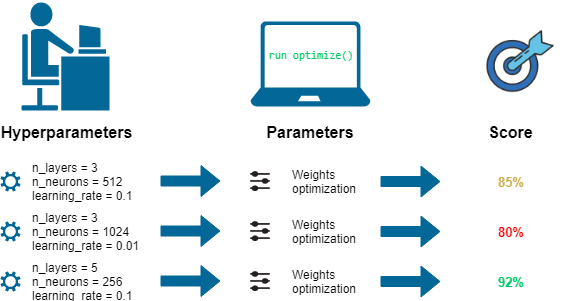

# Hyperparameter Tuning

## ¿Qué son los hiperparametros?

Los hiperparámetros son valores que nosotros debemos iniciailizar en la red, esos valores no pueden ser aprendidos por la red neuronal cuando se esta entrenando.

Por ejemplo en una red neuronal convolucional, algunos de los hiperparámetros son: tamaño del kernel, numero de capas en la red neuronal, función de ativación, funciónde perdida, optimizador usado(ej.: decente gradiente, RMSprop), numero de lotes y número de poecas para entrenar, etc.

|  |
|:--:|
| **Hyperparameters.png** from: [Practical Hyperparameter Optimization](https://www.kdnuggets.com/2020/02/practical-hyperparameter-optimization.html)|

Cada red neuronal tendrá su mejor conjunto de hiperparámetros que conducirán a la máxima precisión. podriamos preguntarnos, "*hay tantos hiperparámetros, ¿cómo elijo qué usar para cada uno?*". Desafortunadamente, no existe un método directo para identificar el mejor conjunto de hiperparámetros(*al menos yo no lo he encontrado aún (today is: 17/02/2020)*) para cada red neuronal, por lo que se obtiene principalmente mediante prueba y error(*no te parece eso curioso?.jpg*). Pero, hay algunas mejores prácticas para algunos hiperparámetros que se mencionan a continuación, 

## Learning Rate

Elegir una *tasa de aprendizaje*(*learning rate*) óptima es importante, ya que decide si su red converge a los mínimos globales o no. Seleccionar una alta *tasa de aprendizaje* casi nunca lo lleva a los mínimos mundiales, ya que tiene una muy buena posibilidad de superarlo. Por lo tanto, siempre estás cerca de los mínimos globales, pero nunca converges con ellos. Seleccionar una pequeña *tasa de aprendizaje* puede ayudar a que una red neuronal converja con los mínimos globales, pero lleva una gran cantidad de tiempo. Por lo tanto, debe capacitar a la red durante un período de tiempo más largo. Una pequeña *tasa de aprendizaje* también hace que la red sea susceptible a quedarse atrapada en el mínimo local. es decir, la red convergerá en un mínimo local y no podrá salir debido a la pequeña *tasa de aprendizaje*. Por lo tanto, debe tener cuidado al establecer la *tasa de aprendizaje*.

## Network Architecture

|  |
|:--:|
| **Red neuronal**|

No existe una *arquitectura estándar* que nos brinde una alta precisión en todos los casos de prueba. Tienes que experimentar, probar diferentes arquitecturas, obtener inferencia del resultado e intentar nuevamente. Una idea que sugeriría es utilizar arquitecturas probadas en lugar de construir una propia. Por ejemplo para la tarea de reconocimiento de imágenes, tiene *VGG net*, *Resnet*, la *Google’s Inception network* , etc. Todos estos son de código abierto y han demostrado ser muy precisos, por lo tanto, puede copiar su arquitectura y ajustarlos para su propósito.

## Optimizers and Loss function

Hay una gran cantidad de opciones disponibles para que que podamos elegir (*de los cuales yo solo uso como dos, realmente no se porque estoy readactando mis pensamientos en el repositorio :P*). De hecho, incluso podría definir su función de pérdida personalizada si es necesario. Pero los optimizadores utilizados comúnmente son **RMSprop**, **Stochastic Gradient Descent** y **Adam**. Estos optimizadores parecen funcionar para la mayoría de los casos de uso. Las funciones de pérdida comúnmente utilizadas son ***cross entropy*** si nos enfrentamos a una tarea de **clasificación**. Si se está realizando una tarea de regresión, el ***mean squared error (error cuadrático medio)*** es la función de pérdida comúnmente utilizada. Algo que he estado aprendiendo durante mis estadias en el CICATA y que me repite en estos ultimos dias mi asesora es que debemos de sentirnos libres de experimentar con los hiperparámetros de estos optimizadores y también con diferentes optimizadores y funciones de pérdida, en pocas palabras todo lo que podamos controlar nosotros que no se aprendido durante el entrenamiento podemos modificarlos para hacer pruebas y ver como cambia nuestra exactitud.

## Batch Size & Number of Epochs

Nuevamente tocando el tema, no existe un valor estándar para el tamaño de lote y las épocas que funcione para todos los casos de uso. Tienes que experimentar y probar diferentes. En la práctica general, los valores de tamaño de lote se establecen como 8, 16, 32(*por lo menos en lso ejemplos que yo he estado encontrando en itnernet a lo largo de mi busqueda de informacion relacionada al tema*)... El número de épocas depende de la preferencia del desarrollador y de la potencia de cálculo que tenga, esto básicamente porque puede que no contemos con un buen procesador y/o buena GPU, sin embargo una buena herramienta que se puede usar es Google colab, de la cual probablemente tambien deje un resumen posteriormente, esta herramienta me la recomendo mi asesora y sinceramente procesa mejor y más rapido que una GTX 1050 en lo que llevo probandola.

## Activation Function

||
|:--:|
| **Red neuronal**|

Las funciones de activación asignan las entradas funcionales no lineales a las salidas. Las funciones de activación son muy importantes y elegir la función de activación correcta ayuda a su modelo a aprender mejor. Hoy en día, la Unidad lineal rectificada (ReLU) es la función de activación más utilizada, ya que resuelve el problema de la desaparición de gradientes **Jason Brownlee, How to Fix the Vanishing Gradients Problem Using the ReLU**. Anteriormente, Sigmoid y Tanh eran la función de activación más utilizada. Pero sufrieron el problema de la desaparición de los gradientes, es decir, durante la propagación hacia atrás, los gradientes disminuyen su valor cuando alcanzan las capas iniciales. Esto detuvo la escala de la red neuronal a tamaños más grandes con más capas. ReLU pudo superar este problema y, por lo tanto, permitió que las redes neuronales fueran de gran tamaño.
